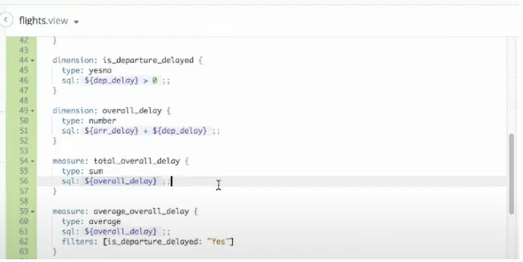
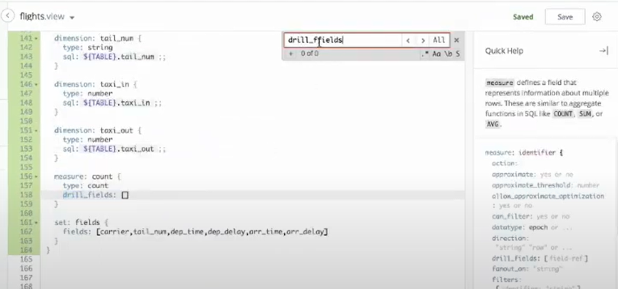

# Objetivos
Nesse curso vamos aprender a usar o Looker com a ideia de analisar dados referentes a vôos dos Estados Unidos, como cancelamentos, atrasos, acidentes, frotas de aviões, linahs aéreas, entre outros.

Para isso contamos com uma base de dados pública e podemos assim fazer a aplicação dos conceitos do Looker para o aprendizado.

---

# Initial configuration
O primeiro detalhe importante é verificar sua *Time Zone*, pois ela afeta todos os *Schedules* feitos no Looker. Existe a possíbilidade de ativar diferentes *Time Zones* por usuários caso necessário.

Podemos também já verificar nossa paleta de cores padrão para a visualização no Looker. Geralmente vamos precisar alterar essa paleta com os códigos hexadecimais de cada cor referetes a empresa.

Em *Technical Support* colocamos um e-mail para contato referente as novas atualizações e mudanças que podem vir a acontnecer no Looker.
> No botão de ajuda temos também as *Release Notes* para leitura caso necessário, lembrando que as atualizações são mensais, exceto em dezembro.

# Creating a New Project
Quando criamos um projeto em branco precisamos de um repositório git para que ele possa ter uma base. Primeiro criamos o repositório e pegamos sua chave **SSH**. No Looker aplicamos essa **SSH** e pegamos seu código *Deploy* que foi gerado para posteriormente aplicarmos novamente no git e sincronizar ambos.

Com isso feito, podemos então selecionar a opção **Create View from Tables* para selecionarmos nossas tabelas que serão utilizadas da base de dados.

Após selecionadas, o Looker automaticamente irá gerar suas *Views*, já indicando suas *Primary Keys*, fonte de dados e tipo de dado.
> É sempre bom verificar as *primary keys* para ver se fazem sentido.
> Podemos usar a aba **SQL Runner** para verificar o conteúdo de nossas bases de dados sem precisar ir até nosso banco diretamente. As consultas podem ser feitas com o SQL padrão da sua base de dados.

Quando uma nova *View* é criada, temos uma *Measure* padrão que seria a ```count```. Nela podemos adicionar o parâmetro ```label``` que vai representar a contagem de eventos daquela tabela.
> É uma boa prática sempre adicionar a ```label```com o nome respectivo do que ela representa para ter assim maior clareza na apresentação dos dados.

# Dimensions and Measuring
Quando criamos uma *Dimension* queremos sempre manter seu nome ocm letra minusculas e em caso de espaçamento usamos o "_"(underline), além disso temos dois parâmetros que são obrigatórios em todos os casos. Eles seriam o ```type``` e o ```sql```:
    - Em ```type``` fazemos a especificação da variavel, indicando se é to tipo string, number, date, etc.
    - Já em ```sql``` apontamos para o Looker aonde ele pode obter esse dado. Aqui temos algumas outras opções como: ```sql_start``` e ```sql_end```que calcula tempo e ```sql_latitude``` e ```sql_longitude``` que calcula distância entre dois pontos ou uma localização.
> Um ponto importante é lembrar que no parâmetro ```sql``` da *Dimension* podemos refenciar a fonte de dados direto em nossa base de dados com o comando ```${TABLE}```. Caso contrário, estamos referenciado uma tabela ja existente no Looker. Sempre que possível usar a ja existente no Looker, pois assim em caso de mudanças, isso será alterado automáticamente.

Quando vamos trabalhar com *Measures* precisamos referenciar *Dimensions* para a execução dos calculos a serem feitos. As *Measures* por sua vez também possuem seus *types* relacionados a agregação de dados como: ```sum```, ```count```, entre outros.

# Filtered Measures and Drill Fields
Quando precisamos filtrar uma *Measure* podemos aplicar nela o parâmetro ```filter``` que vai possibilitar escolhermos uma *Dimension* (geralmente yesno) e em seuida dizer qual o resultado que queremos filtrar. Veja o exemplo abaixo, entre as linhas 59 e 63:


Agora caso seja necessário aprensentar dados adicionais sobre uma métrica específica de maneira interativa nas dashboards, podemos aplicar o parêmetro ```drill_fields```, nele específicamos quais *Dimensions* ou *Measures* queremos ver de maneira dinâmica.

Quando temos um ```filter```ou um ```drill_fields``` que vamos usar repetidas vezes, podemos criar um *Set* que seria como uma regra que pode ser referenciada em nossas *Views*. Logo abaixo podemos ver um exemplo de *Set* criado para específicar um ```drill_fields``` na nossa *View*:


Quando criamos o *Set*, usamos "[]" para selecionar as *Dimensions* que vamos fazer o *Drill*. E quando vamos usar o *Set*, podemos usar a sintaxe:
```SQL
dimension: nome {
    type: tipo
    sql: ${TABLE}
    filter: [nome_set*]
}
```
Usamos a * para sinalizar que queremos todos os campos definidos no *Set*. Caso seja necessário tirar um dos campos presentes naquele *Set* fazemos o uso do argumento ```-dimension```, da seguinte maneira:
```SQL
dimension: nome {
    type: tipo
    sql: ${TABLE}
    filter: [nome_set*, -dimension]
}
```

# Explore Joins - Part 1 (Basic)
Quando vamos fazer a *Join* entre as *Views*, usamos 3 parâmetros principais:
- ```type```: aqui escolhemos qual o tipo de *Join* que será utilizado. (left_outer | cross | full_outer | inner
- ```sql_on```: que seriam as *primary_keys* em que vai ocorrer a relação entre as tabelas.
- ```relationship```: aqui definimos a cardinalidade deste *Join*.

Outro campo opcional seria a ```view_label``` que é como será representado o nome dessa nova *View* para os usuários.