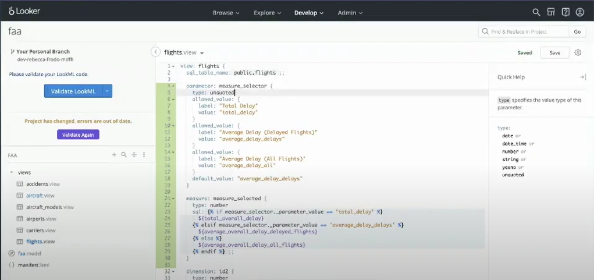
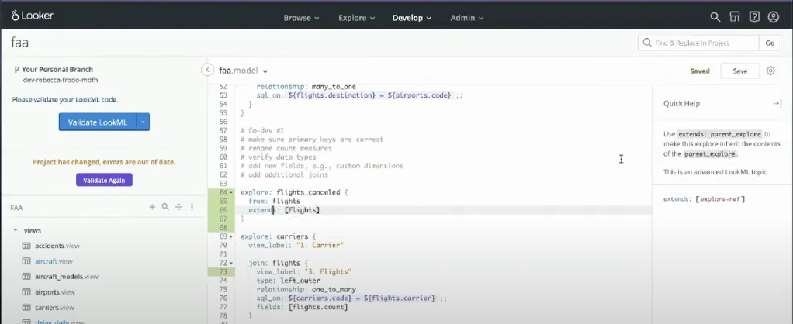

# Explore Joins - Part 2
Quando precisamos realizar um *Join* que repete a origem, podemos na *Model* criar uma referência com o parâmetro *From*. No exmeplo abaixo, vemos da linha 39 até 52, um caso de repetição no nome do join, para isso usamos o parâmetro from que possibilita reutilizar uma mesma *View* para joins diferentes.


# Constants
Quando trabalhamos com uma palavra, valor ou algo que vai se repetir muitas vezes podemos criar uma ```constant``` para que possa ser referenciada em nossas *Labels*. 
Para fazer essa constante criamos um **Project Manifest** em nosso projeto (fica no + assim como criar Views, etc). Feito isso criamos nosso parâmetro ```constant``` que assume uma *Value* constante para referencia, veja o exemplo abaixo:


Para a aplicação dessa ```constant``` usamos a sintaxe: ```@{nome_constante}```. Veja o exmeplo:


# Liquid for User Experience
Podemos usar o *Liquid* para casos mais avançados, aprimorando assim a experiencia do usuário. O *Liquid permite o uso de html para referenciar links e a possibilidade de novas maneiras de transição entre dashbaords, além de muitas outras funções.

# Content Validator
No menu de *Develop* temos essa ferramenta que possibilita verificar todos os campos desconhecidos presentes no projeto. Basta clicar em validate que temos uma tabela com esses dados.

# Value Formatting and Visualization Improvements
Quando temos um *Look* com números muito extensos como "1.000.000", podemos criar um ```named_value_format``` na *Model* e referencialo na nossa *Explore*, dentro da *View*, para que a sua apresentação seja por exemplo "1,0 M" o algo assim.

Além disso podemos também fazer condicionais para que essa apresentação se comporte de maneira diferente caso seja necessário.


# Parameters
Podemos usar *Parameters* quando temos uma visualização que vai alternar entre filtros, assim não temos uma poluição visual no gráfico. Para utilizar isso usamos no exemplo o parâmetro ```parameter``` dentro da nossa *View* seguido por uma measure que realiza os filtros:


Podemos adicionar dantro do ```parameter``` um parâmetro chamado ```description``` que é uma string que sera apresentada ao usuario como um botão de informação para ler mais sobre como usar aquele filtro.

# Derived Tables and Caching
Alguns pontos importantes sobre *Derived Tables* e Cacheamento:
- *Derived tables* não podem ser usadas com logíca dinamica e variada
- O uso de NDT's ajuda na reutilização do código.

# Refinements, Extends and Explore Filters

## Refinamets
Quando usamos o sinal de mais (+) em uma *View*, estamos fazendo um **Refinamento** nesta *View*, por exemplo se temos uma *View* com a *Dimension* Id e precisamos adicionar um outra *Dimension*, podemos usar a sintaxe:
```
view: +nome_view{
    dimension: nova_dimension{
        label: ".."
        type: "..."
        sql: ...
    }
}
```

Sendo assim nossa *View* original terá um nova *Dimension* adicionada.

## Extends
Já os *Extends* se tratam de cópias exatas de uma *View*. Isso facilita muito quando temos que fazer apenas alguns ajustes em uma mesma *View*. Para fazer isso na *Model*, usamos a sintaxe:
```
explore: nome_explore{
    from: nome_view
    extends: [selecionar a desejada]
}
```

Veja o exemplo abaixo:
