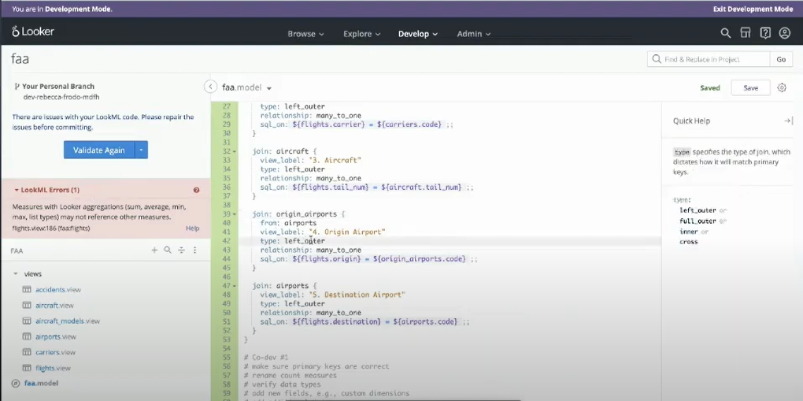
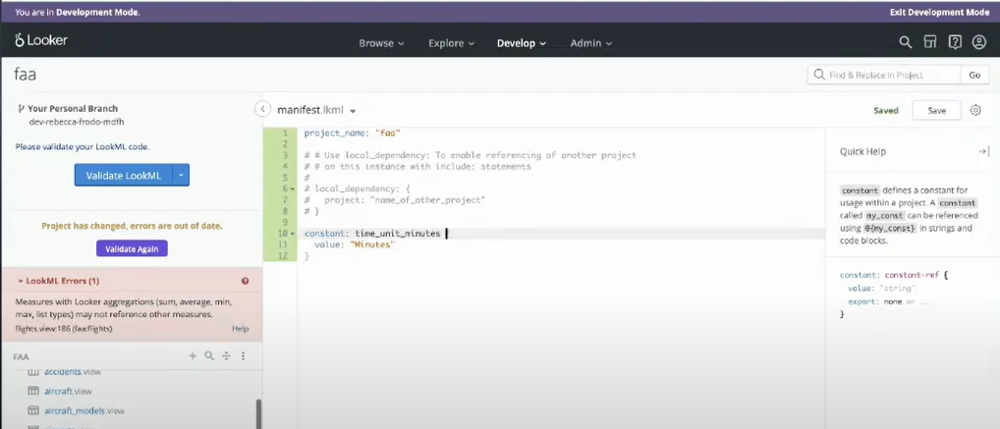
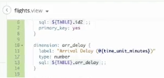
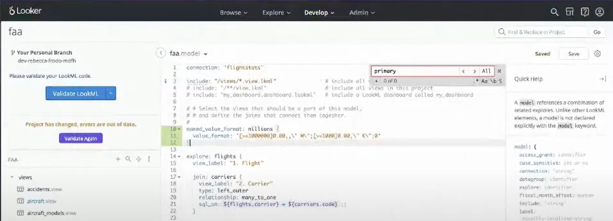

# Explore Joins - Part 2
Quando precisamos realizar um *Join* que repete a origem, podemos na *Model* criar uma referência com o parâmetro *From*. No exmeplo abaixo, vemos da linha 39 até 52, um caso de repetição no nome do join, para isso usamos o parâmetro from que possibilita reutilizar uma mesma *View* para joins diferentes.


# Constants
Quando trabalhamos com uma palavra, valor ou algo que vai se repetir muitas vezes podemos criar uma ```constant``` para que possa ser referenciada em nossas *Labels*. 
Para fazer essa constante criamos um **Project Manifest** em nosso projeto (fica no + assim como criar Views, etc). Feito isso criamos nosso parâmetro ```constant``` que assume uma *Value* constante para referencia, veja o exemplo abaixo:


Para a aplicação dessa ```constant``` usamos a sintaxe: ```@{nome_constante}```. Veja o exmeplo:


# Liquid for User Experience
Podemos usar o *Liquid* para casos mais avançados, aprimorando assim a experiencia do usuário. O *Liquid permite o uso de html para referenciar links e a possibilidade de novas maneiras de transição entre dashbaords, além de muitas outras funções.

# Content Validator
No menu de *Develop* temos essa ferramenta que possibilita verificar todos os campos desconhecidos presentes no projeto. Basta clicar em validate que temos uma tabela com esses dados.

# Value Formatting and Visualization Improvements
Quando temos um *Look* com números muito extensos como "1.000.000", podemos criar um ```named_value_format``` na *Model* e referencialo na nossa *Explore*, dentro da *View*, para que a sua apresentação seja por exemplo "1,0 M" o algo assim.

Além disso podemos também fazer condicionais para que essa apresentação se comporte de maneira diferente caso seja necessário.

  