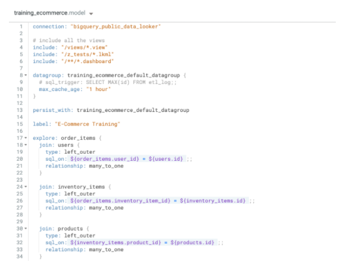

# Objetivos
Nesse laboratório você vai aprender a:
- Definir e ler LookML
- Organizar e entender as estruturas principais do LookML
- Criar uma *View*
- Adicionar **dimensões** e **medidas** na *View*
- Usar o *Join* em uma *View* para um *Explore* já existente.

Para aplicação dos conceitos abaixo, fazer o laboratório: https://googlecourses.qwiklabs.com/focuses/18532?parent=catalog
--- 

# Visão geral das estruturas do LookML
A hierarquia do LookML é estruturada usando os seguintes objetos:

##  Projects
Ele é o objeto de mais alto nível, sendo as bibliotecas de código LookML. Como o Looker usa o **Git** para versionamento de código, **o ideal é ter um repositório para cada projeto**, ou seja, o projeto esta mapeado com apenas uma fonte de dados ou uma conexão com o banco de dados.

## Model
As *Models* são o próximo nível da hierarquia. Elas representam um conjunto de *Explores* de área de negócio ou necessidade. Nas *Models* fazemos a pré-junção das *Views* para a análise de negócio.

Vamos ver uma exemplo de *Model* para explicar alguns pontos:


- A conexão com a base de dados é definida na ***linha 1***
- Arquivos *View* que podem ser acessados por essa *Model* são definidos nas ***linhas 4,5 e 6***
- Temos também a partir da ***linha 17***, definções das *Explores** e seus *Join* em

As *Models* Podem ser usadas para restringir o acesso de usuários a algumas *Explores* e separar/organizar *Explores* por área de negócio.

## Explores
São a compressão de uma ou mais *Views* unidas pelo *Join*, geralmente apresentam uma questão específica do negócio. Para melhor uso, elas devem ser organizadas por um tema de negócio para evitar confusão por parte dos usuários.

Podemos pensar nas *Explores* como um conjunto d etabelas prédefinidos que vão ser unificados para responder perguntas ou casos específicos do negócio.

## View
É a tabela da base de dados ou sua representação lógica. Cada *View* inclui **Dimensions** (Colunas) e **Measures**(Que são a agregação das linhas de modo geral, como ```Count```, ```SUM```, etc).

Podemos dividir as *Views* em dois tipos:
1. **Standard views**: que são abstrações de tabelas existentes na base de dados
2. **Virtual tables**: também chamadas de *derived tables*, que são uma representação lógica de uma *View* derivada de uma existente.

## Fields
O nivel de hierarquia mais baixo no LookML. Nesse tipo de objeto temos as **Dimensions** e as **Measures**.

### Dimensions
Elas representam as colunas da nossa tabela (*View*). É possível também criarmos dimensões adicionais que vão servir como uma representação lógica. Elas aparecem no ```SELECT```e ```GROUP BY``` do SQL do código LookML.

### Measures
São a agregação do que existe na nossa tabela da base de dados. Elas devem ser criadas em LookML e fazem a agregação de valores como ```sums``` e ```counts```.