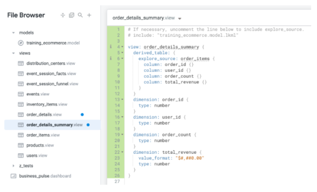

# Objetivos
Nesse laboratório vamos:
- Modificar um projeto LookML já existente
- Criar uma *Derived Table* com SQL
- Criar uma *Derived Table* nativa
- Dar *Join* em novas *Views* de *Derived Tables* Para um *Explore*

Para aplicação dos conceitos abaixo, fazer o laboratório: https://googlecourses.qwiklabs.com/focuses/18529?parent=catalog
---

# Create a SQL derived table summarizing details for each order

Com o LookML podemos usar queries SQL para criar uma *Derived Table* com SQL ou usar queries do *Explore* para criar uma *Derived Table* nativa.

## Define a new derived table using a SQL query
Para criar uma *Derived Table* com SQL acessamos a aba **Develop > SQL Runner**. A partir dai adicionamos então nosso código SQL para criação da *Derived Table*.

## Create a new view file for the SQL derived table
Feito esse passo podemos agora adicionar essa tabela ao projeto. No ícone de *settings* selecione **Add to Project** e selecione o projeto e de um nome a essa nova *View*.

Com isso agora o que resta é configurar cada variavel com seu tipo de dado e informações adicionais (como se é chave primária, *hidden*, entre outros.)

O resultado final é algo semelhante a isso:


# Create a native derived table summarizing details for each order
Outra alternativa então são as *Native Derived tables* (NDT's) que são expressadas totalmente em LookML. A prinjcipal vantagem aqui é o princípio da **reusabilidade** graças ao LookML.

A ideia aqui é usar as *Dimensions* e *Measures* já existentes em outras *Views* para a criação dessa nova.

## Define a new native derived table from an Explore query
Vamos começar definindo a NDT indo até a explore desejada e selecionando as *Dimensions* e *Measures* que vamos usar nessa nova view. Após revisar tudo e confirmar que é isso que você deseja vá até o ícone de *settings* e selecione **Get LookML**.

Uma nova janela vai abrir como essa abaixo:


Podemos então copiar o código gerado na aba **Derived Table**.
> Podemos copiar apenas o conteúdo central se quiser.

## Create a new view file for the native derived table
Com esse código vamos agora criar uma nova view indo em **Develop** selecionando o projeto desejado e no ícone + selecionar **Create View**.

Inserimos o nome dessa nova *View* e por fim colamos o código copiado a partir da ```linha2```. Teremos então algo semelhante a isso:


# Join a new view to an Explore

Para fazer o *Join* de uma *Derived Table* seja ela por querie SQL ou nativa, o processo é o mesmo.

## Join the view for the *Derived Table*
No arquivo *Model* do seu projeto, vá até a *Explore* que corresponde a aquela que será referenciada com o nosso *Join*.

Já na *Explore*, façaa definição entre a *View* criada com a *Derived Table* e a *Explore* em que se encontra baseada nas chaves primárias.

> A definição do *Join* se da por ```type```, ```sql_on``` e ```relationship```.

# Persist a derived table
Até agora as *Derived tables* tem sido efêmeras, ou seja, o Looker produz tabelas temporárias para a execução das queries no *Explore*. Vamos ver então um tipo de *Derived table* que é a **persistent**.

Esse tipo de *Derived table* é escrito e armazenado na base de dados conectada, sendo assim ela possui a vantagem de reduzir o tempo para execução de queries, mas a desvantagem de requisitar espaço para o armazenamento físico (o que afeta o custo).

Os passos para fazer uma *Derived Table* ficar como *persistent* são os mesmo que para  fazer uma *Derived Table* SQL ou nativa. Para fazer então essa transformação, é necessário usar um ou dois dos seguintes parâmetros:
- ```datagroup_trigger```: utiliza um datagroup ou política de cache já definida na *Model*. Se tivermos então datagroups definidos, essa é a melhor prática para a criação da *persistent*.
- ```sql_trigger_value```: esse parâmetro usa um SELECT pré-escrito que retorna um valor. O Looker envia esse valor para a base de dados repetidamente, e se o resultado for alterado ele reconstrói a *persistent* existente.
- ```persist_for```: é o parâmetro que instruí a *persistent* a ficar disponível por um tempo determinado.

Visto que o benefício principal de usar *persistents tables* é minimizar o tempo de execução de queries, o ideal seria o uso de ```persist_for``` com ```sql_trigger_value```. Assegurando assim que a *persistent table* fique sempre atualizada e disponível por um tempo expecífico, caso nenhum usuário a utilize ela some e não consome o espaço físico até ser acionada de novo.

## Persist the derived table
Para fazer uma *Derived Table* se tornar persistente precisamos apenas adicionar um dos parâmetros acima na *View* desejada. No exemplo abaixo vamos usar o ```datagroup_trigger``` para tornar a *View* order_details_summary em uma *persistent table*.
