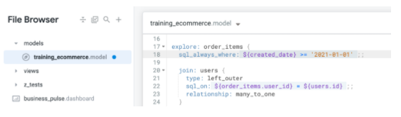
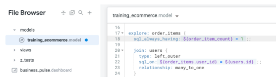
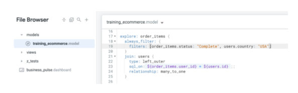
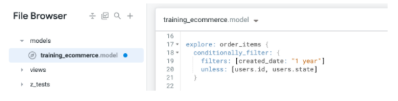

# Objetivo
Nesse laboratório vamos:
- Entender os diferentes casos de uso para cada filtro
- Usar os filtros ```sql_always_where``` e ```sql_always_having```
- Usar o ```always_filter```
- Usar o ```conditionally_filter```

Para aplicação dos conceitos abaixo, fazer o laboratório: https://googlecourses.qwiklabs.com/focuses/18531?parent=catalog
---

# Types of Explore Filters

Esse filtros são adicionados no arquivo *Model*, diretamente na *Explore* desejada. Veja abaixo quais os tipos de filtros existentes.

## The ```sql_always_where``` and ```sql_always_having filters```
Tanto o ```sql_always_where``` quanto o ```sql_always_having``` permitem você adicionar filtros a uma *Explore* que **não podem ser modificados**. Sendo assim útil quando você tem certas linhas que sempre vai querer excluir da *Explore*.

O ```sql_always_where``` adiciona no SQL final da *Explore* uma cláusula **WHERE** nas dimensões. Já o ```sql_always_having``` por sua vez adiciona o **HAVING** para as métricas no SQL final da *Explore*.

Não haverá indicação desse filtro para usuários finais de negócio, a não ser que tenham permissão para ver o SQL gerado no final da *Explore*. Assim pode-se filtrar valores para teste ou dados internos.

No exemplo abaixo temos um ```sql_always_where``` sendo aplicado para filtrar resultados a partir do ano 2021:


Nesse próximo exemplo, vamos usar um ```sql_always_having``` para filtrar todos os pedidos que tiveram apenas um item vendido:


> Lembrando que isso não pode ser visto nem alterado pelo usuário final em nenhum dos casos acima.

## The ```always_filter```
O ```always_filter``` permite você faça com que o usuário selecione os filtros que você definiu serem necessários para a consulta. Assim o usuário não consegue realizar a consulta sem os filtros selecionados estarem preenchidos, o que ajuda a evitar consultas enormes sem necessidade.

Esses filtros pré-definidos já possuem um valor padrão, que é definido por você, mas podem ser alterados a critério do usuário que utiliza essa *Explore*.

O exemplo abaixo faz com que a *Explore* já venha por padrão com o filtro de ```status = complete``` e ```country = USA```:


## The ```conditionally_filter```
De maneira similar ao ```always_filter```, o ```conditionally_filter``` permite adicionar diretamente na UI do usuário uma maneira de realizar a filtragem de dados.

Nesse caso temos uma lista pré-definida de filtros que os usuários podem alterar **se** eles aplicarem no mínimo um outro filtro de outra lista que foi pré-definida.

A ideia, assim como anteriormente, é que o usuário não consegue realizar a consulta sem ao menos um filtro selecionado, o que ajuda a evitar consultas enormes sem necessidade.

No exemplo abaixo vamos fazer com que a *Explore* filtre apenas os dados do último ano **a não ser que** um filtro seja aplicado a *user_id ou state*:
