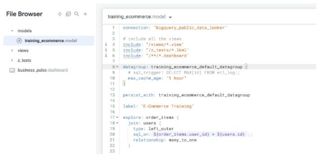
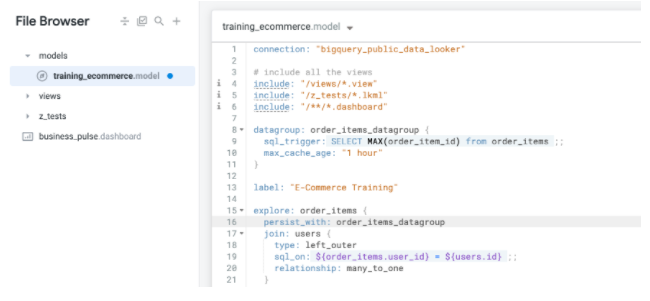

# Objetivos
Nesse laboratório vamos:
- Definir cacheamento e defirentes tipos de objetos datagooup em LookML.
- Aplicar um datagroup em uma *Explore* individual em uma *Model* de LookML

Para aplicação dos conceitos abaixo, fazer o laboratório: https://googlecourses.qwiklabs.com/focuses/18528?parent=catalog

---

# Caching in Looker
O Looker atua como a porta de entrada para nossa base de dados. Uma caracteristica que podemos notar com o Looker é que quando executamos uma query ele checa se essa Query ja foi executada anteriormente.

Caso não tenha sdio executada ele faz a execução e armazena seus resultados em cache para futuras pesquisas e referencias.

Caso tenha sido executada a primeira coisa que ele faz é verificar se as políticas de cacheamento são válidas para aquela consulta:
    - Se sim ele ele simplismente retorna os resultados para o usuário de negócio.
    - Se não ele faz a execução da query e substitui o cache antigo pelo atualizado.

## Datagroups
Os **datagroups** nada mais são do que a nomeção das políticas de cache no Looker, sendo que eles podem ser aplicados em: *Models*, *Explores* e *Persistent Derived Tables* (PDT's).

Cada **datagroup** criado requer diferentes definições de comportamento, e isso varia de acordo com o processo de ETL e requisitos de negócio.

Geralmente podemos dividir a atribuição de **datagroups** em três níveis:
- Nível de *Model*
- *Explores* individuais
- Em PDT's

Quando aplicamos essa política a nível de *Model*, ela vai ser
aplicada a todas as *Explores* presentes nessa *Model*. Entretanto, caso posteriormente uma nova regra seja aplicada a uma dessas *Explores*/PDT's específicamente, a regra de cache será substituida pela nova aplicada.

## Objects that can use datagroups
### ```Persist_with```
É o objeto mais comum para a aplicação/ativação do datagroup em um dos níveis possíveis. 

Caso seja um datagroup de nível *Model* podemos aplicar nosso ```Persist_with``` na parte mais exterior do código referenciando nosso Datagroup, veja o exemplo abaixo:


Agora se queremos aplicar nosso datagroup em uma ou um conjunto específico de *Explores* podemos inserir nosso ```Persist_with``` logo no início da nossa *Explore*, Veja o exemplo abaixo quando queremos apenas em *Order_itens*:
 

### ```Datagroup_trigger```
Serve para quando queremos específicar como vamos reconstruir uma PDT.

### ```Schedules```
Servem tanto para Looks (Visualizações) e Dashboards, com a ideia de instruir o Looker a executar automáticamente a atualização e fazer o "pré-cache" dessas visualizações para o usuário de negócio que for utilizar esses dados.

## Datagroup configuration
Quando vamos usar um **datagroup** precisamos específicar 2 parâmentros:
- ```max_cache_age```: que específica o numero de horas que esse cache ficará armazenado
-```sql_trigger```: É o nosso SELECT que será feito para a verificar se ocorreram mudanças na nossa base de dados, fazendo assim o gatilho para a atualização ser ativado e atualizando o cache.

> Podemos usar apenas um deles, mas o **recomendado** é o uso de ambos, pois caso o ```sql_trigger``` tenha algum erro ou o ETL tenha algum problema, vamos garantir a atualização com o ```max_cache_age```.

## Persist_for
O ```persist_for``` é um cache que é executado uma vez, fica pelo tempo determinado e depois não tem mais atualização a não ser que seja executado novamente.